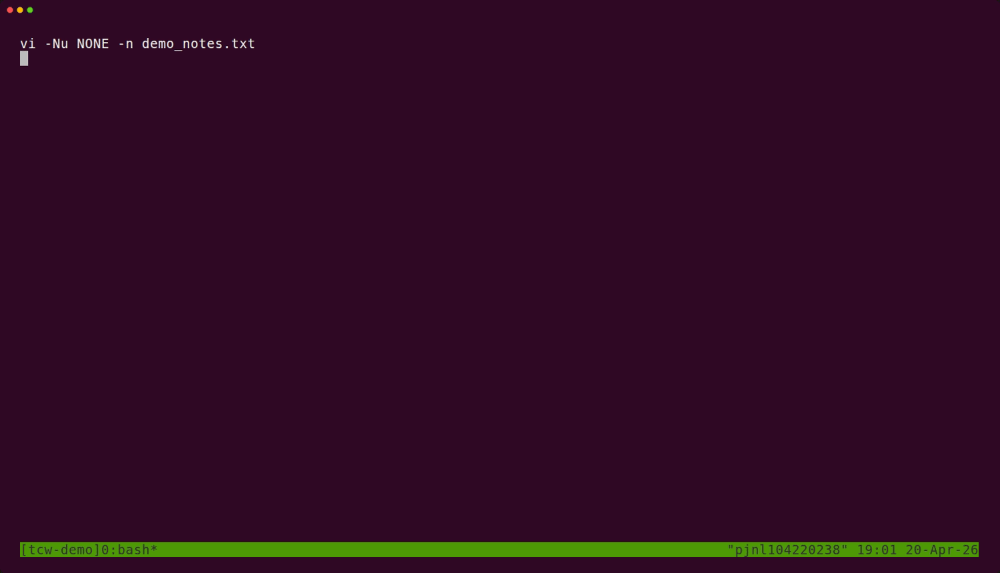

# Terminal Capture Workflow

[English](./README.md)



`terminal-capture-workflow` 是一个 Codex skill，用来生成终端截图、分阶段 PNG、GIF、MP4/WebM 演示，以及用于人工视觉验收的抽帧结果，而且不依赖操作系统级别的桌面鼠标键盘注入。

## 覆盖能力

- 面向文档、操作指引、报告、评论区的 `ttyd + Playwright` 截图
- 面向 `gif`、`mp4`、`webm` 和关键帧截图的 `VHS` 渲染
- 动态资源默认在结尾驻停，同时支持用户自定义驻停时长
- 泛化输入模型，支持任意文本、多行粘贴、按键、组合键和多阶段交互流程
- 真实 TUI 和 shell 交互，例如 `tmux`、`vi`/`vim`、`less`、确认提示、向导式 CLI
- 通过分页器处理长输出，而不是硬塞进一张图
- 通过探测媒体信息和抽帧做人工视觉验收
- 同时支持用户指定 ttyd 和 VHS 的窗口大小

## 输入模型

scenario 不只支持 `y/N` 这类固定确认，而是可以自由组合交互动作：

- `type`：输入文本，但暂时不回车
- `paste`：快速注入文本，支持多行内容
- `press`：按一个键或组合键，例如 `ctrl+b`、`ctrl+shift+*`、`ctrl+[`、`alt+enter`、`pagedown`
- `input`：把 `text`、`paste`、`press`、`sleep` 事件组合成复杂交互序列
- `raw_vhs`：当你需要写显式 VHS tape 指令时使用的逃生口

修饰键名称会做大小写无关归一化，所以 `ctrl+b`、`Ctrl+B`、`CONTROL+b` 都能识别。像 `ctrl+*`、`ctrl+shift+*`、`ctrl+%`、`ctrl+[` 这类“修饰键 + 可打印字符”组合，两条引擎链路都支持。如果你需要的是 VHS 自身语法不接受的“修饰键 + 特殊键”组合，优先走 `ttyd + Playwright`。

## 安装依赖

Debian 或 Ubuntu 基础包：

```bash
sudo apt update
sudo apt install -y ttyd ffmpeg less python3-pil nodejs npm
```

安装 VHS：

```bash
sudo mkdir -p /etc/apt/keyrings
curl -fsSL https://repo.charm.sh/apt/gpg.key | sudo gpg --dearmor -o /etc/apt/keyrings/charm.gpg
echo "deb [signed-by=/etc/apt/keyrings/charm.gpg] https://repo.charm.sh/apt/ * *" | sudo tee /etc/apt/sources.list.d/charm.list >/dev/null
sudo apt update
sudo apt install -y vhs
```

在 skill 目录里安装 Playwright 包：

```bash
npm install
```

如果系统里没有 Chrome 或 Chromium：

```bash
npx playwright install chromium
```

## 基本使用

先检查环境：

```bash
python scripts/terminal_capture.py check
```

渲染 scenario：

```bash
python scripts/terminal_capture.py render all /path/to/scenario.json
```

选择抽帧时间点前先探测媒体信息：

```bash
python scripts/terminal_capture.py probe-media /path/to/demo.mp4
```

从视频或 GIF 中抽取验收帧：

```bash
python scripts/terminal_capture.py extract-frames /path/to/demo.mp4 --times 0.8,2.4,4.8
```

## 仓库结构

- [`SKILL.md`](./SKILL.md)：给 Codex 用的工作流说明
- [`scripts/terminal_capture.py`](./scripts/terminal_capture.py)：环境检测、统一渲染入口、媒体验收辅助能力
- [`scripts/render_ttyd_scenario.js`](./scripts/render_ttyd_scenario.js)：ttyd + Playwright 渲染器
- [`references/environment-and-install.md`](./references/environment-and-install.md)：依赖与安装说明
- [`references/scenario-patterns.md`](./references/scenario-patterns.md)：scenario 结构与交互模式
- [`assets/tmux-vi-showcase.gif`](./assets/tmux-vi-showcase.gif)：由这套工作流真实渲染出的展示 GIF

## 说明

- scenario JSON 应该放在目标工作区，而不是 skill 目录里。
- 能等可见文本时，就优先用可见文本等待，不要滥用固定 sleep。
- 脆弱的 shell pipeline 先封装成工作区脚本，再放进 scenario。
- 长输出优先接到 `less -R` 或其他分页器，而不是强行塞进一张图。
- 动态输出默认会在最后一帧额外停 2 秒；如果用户要自己控制，就设置 `vhs.endHoldSeconds`，设成 `0` 则关闭。
